# RIMSS Software User's Manual

**RAMPOD Inventory & Maintenance System Software**  
**Version 2.0**  

**Document Version:** 2.0  
**Date:** February 6, 2026  
**Classification:** CUI - Controlled Unclassified Information

---

## Table of Contents

1. [Introduction](#1-introduction)
2. [Getting Started](#2-getting-started)
3. [Assets Module](#3-assets-module)
4. [Maintenance Module](#4-maintenance-module)
5. [PMI Module](#5-pmi-module)
6. [Configurations](#6-configurations)
7. [Sorties](#7-sorties)
8. [Spares](#8-spares)
9. [Parts Ordering](#9-parts-ordering)
10. [Software Tracking](#10-software-tracking)
11. [Notifications](#11-notifications)
12. [Reports](#12-reports)
13. [Administration](#13-administration)
14. [Appendices](#14-appendices)

---

## 1. Introduction

### 1.1 Purpose

RIMSS (RAMPOD Inventory & Maintenance System Software) is a comprehensive web-based application for tracking military aviation assets, maintenance activities, and logistics operations. This manual provides complete instructions for all system features.

### 1.2 Supported Programs

| Program | Full Name | Description |
|---------|-----------|-------------|
| **ACTS** | Advanced Targeting Capability System | Targeting pod maintenance |
| **ARDS** | Aerial Reconnaissance Data System | Reconnaissance systems |
| **CRIIS** | Combat Radar Integrated Information System | Radar systems |
| **236** | Program 236 | Electronic warfare systems |

### 1.3 System Capabilities

- **Asset Management** - Serial number tracking, location management, hierarchy
- **Maintenance** - Event/Repair/Labor workflow with full audit trail
- **PMI** - Preventive maintenance scheduling (calendar and meter-based)
- **Configurations** - Assembly structure management (5-level hierarchy)
- **Sorties** - Flight mission tracking and correlation
- **Spares** - Spare parts pool management
- **Parts Ordering** - SHOP/DEPOT procurement workflow
- **Shipping** - TCN tracking and in-transit management
- **Reports** - Comprehensive operational reporting
- **Administration** - User and code management

### 1.4 User Roles

| Role | Permissions |
|------|-------------|
| **ADMIN** | Full system access |
| **DEPOT_MANAGER** | Approve orders, manage spares, full maintenance |
| **FIELD_TECHNICIAN** | Create events, repairs, labor; request parts |
| **VIEWER** | Read-only access to all data |

---

## 2. Getting Started

### 2.1 System Login

Access RIMSS through your web browser at the designated URL.


**Login Procedure:**
1. Enter your **Username**
2. Enter your **Password**
3. Click **Sign In**

> ⚠️ **Security Notice:** All activity is monitored. Authorized users only.

### 2.2 Dashboard Overview

After successful login, you'll see the main Dashboard.

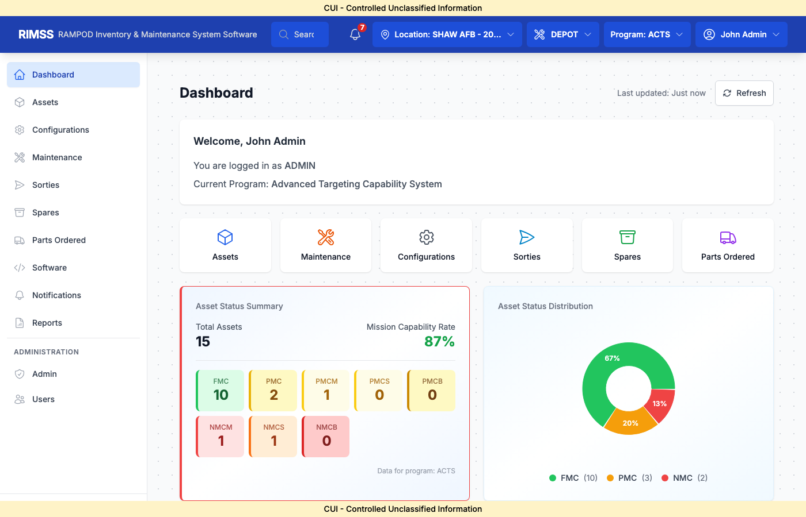

**Dashboard Components:**

| Area | Description |
|------|-------------|
| **Header Bar** | Location selector, Role (DEPOT/SHOP), Program selector, User menu |
| **Navigation Sidebar** | Access to all modules |
| **Asset Status Summary** | Color-coded status counts (FMC/PMC/NMCM/NMCS) |
| **Mission Capability Rate** | Overall readiness percentage |
| **Asset Status Distribution** | Pie chart visualization |
| **PMI Due Soon** | Upcoming/overdue inspections |
| **Quick Action Cards** | One-click access to common functions |

**Status Color Coding:**
- 🟢 **Green (FMC)** - Fully Mission Capable
- 🟡 **Yellow (PMC/PMCM/PMCS)** - Partially Mission Capable
- 🔴 **Red (NMCM/NMCS)** - Not Mission Capable

### 2.3 Program and Location Selection

**To change your current program:**
1. Click the **Program** dropdown in the header
2. Select from: ACTS, ARDS, CRIIS, or 236
3. Dashboard and data refresh automatically

**To change your location:**
1. Click the **Location** dropdown
2. Select from your assigned locations
3. Data filters to selected location

### 2.4 Role Selection (DEPOT vs SHOP)

The role toggle affects what actions are available:

| SHOP Role | DEPOT Role |
|-----------|------------|
| Create maintenance events | Approve parts orders |
| Request parts | Issue from spares pool |
| Record labor | Manage depot work orders |
| Ship assets | Receive shipments |

---

## 3. Assets Module

### 3.1 Viewing Assets

Navigate to **Assets** from the sidebar.


**List Features:**
- **Search** - Filter by serial number, part number, or name
- **Status Filter** - Show only specific statuses
- **Export PDF** - Generate formatted report
- **Export Excel** - Download data for analysis
- **+ Add Asset** - Create new asset (Admin only)

**Table Columns:**
| Column | Description |
|--------|-------------|
| Serial Number | Unique asset identifier |
| Part Number | Catalog part number |
| Name | Part nomenclature |
| Status | Current mission capability (badge color-coded) |
| Assigned Base | Administrative location (LOC_ID_A) |
| Current Base | Custodial location (LOC_ID_C) |

**Special Badges:**
- **BA** (Red) - Bad Actor - Asset with chronic failures
- **Transit** (Blue) - Asset is being shipped

### 3.2 Asset Status Codes

| Code | Full Name | Color | Meaning |
|------|-----------|-------|---------|
| FMC | Fully Mission Capable | 🟢 Green | Operational |
| PMC | Partially Mission Capable | 🟡 Yellow | Reduced capability |
| PMCM | Partially Mission Capable - Maintenance | 🟡 Yellow | Awaiting maintenance |
| PMCS | Partially Mission Capable - Supply | 🟡 Yellow | Awaiting parts |
| NMCM | Not Mission Capable - Maintenance | 🔴 Orange | Grounded - maintenance |
| NMCS | Not Mission Capable - Supply | 🔴 Orange | Grounded - parts |
| CNDM | Condemned | ⚫ Gray | No longer serviceable |
| DEPOT | In Depot | ⬛ | At depot for repair |
| INACTIVE | Inactive | ⬜ | Not in active inventory |

### 3.3 Creating an Asset

Click **+ Add Asset** to open the creation wizard.

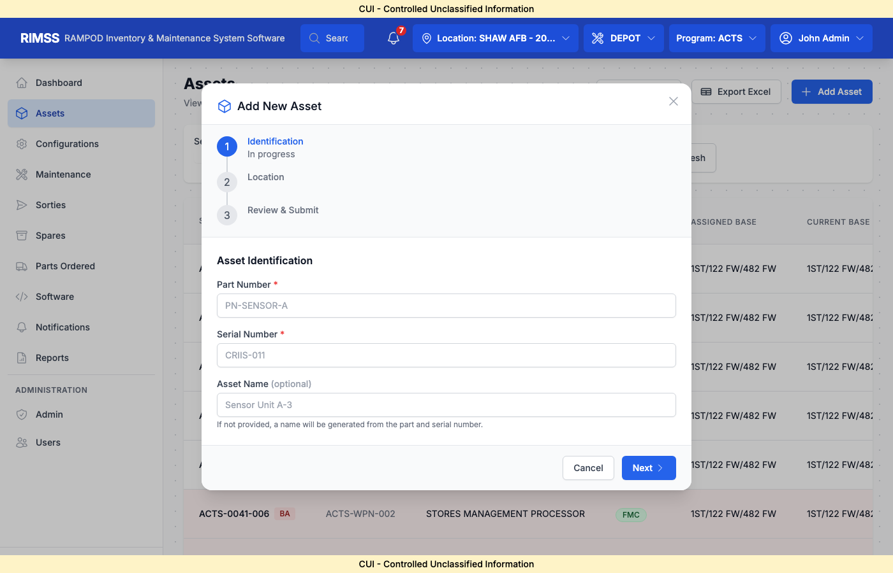

**Step 1: Identification**
- **Part Number** (required) - Select from parts catalog
- **Serial Number** (required) - Unique identifier
- **Asset Name** (optional) - Auto-generated if blank

**Step 2: Location**
- **Assigned Location** - Administrative home base
- **Current Location** - Where asset physically is

**Step 3: Review & Submit**
- Verify all information
- Click **Create Asset**

### 3.4 Asset Detail View

Click any asset row to view full details.


**Detail Sections:**
- **Header** - Serial number, part number, status badge
- **Location Info** - Assigned vs Current location
- **Configuration** - Assigned configuration set
- **Child Assets** - SRU/LRU hierarchy (if NHA)
- **Maintenance History** - Recent events
- **Meter History** - ETI readings
- **Sortie History** - Flight missions

### 3.5 Asset Transfers

**To transfer an asset:**
1. Open asset detail
2. Click **Transfer** or **Ship**
3. Enter transfer details:
   - Destination location
   - Shipper name
   - Expected delivery date
4. System generates **TCN** (Transportation Control Number)
5. Asset status changes to **In Transit**

**Business Rules:**
- Asset `in_transit` flag set to `true`
- `ship_date` recorded
- `tcn` assigned
- `loc_idc` (current location) clears until receipt

### 3.6 Asset Hierarchy

Assets can form parent-child relationships:

```
POD (Parent NHA)
├── Sensor Assembly (Child SRU)
│   ├── Camera (Child LRU)
│   └── Processor (Child LRU)
└── Power Unit (Child SRU)
```

**NHA (Next Higher Assembly):**
- `nha_asset_id` links child to parent
- Up to 5 levels of nesting supported
- Removing a part clears the NHA relationship
- Installing a part sets the NHA relationship

---

## 4. Maintenance Module

### 4.1 Maintenance Overview

The Maintenance module is the core of RIMSS, tracking all repair activities.

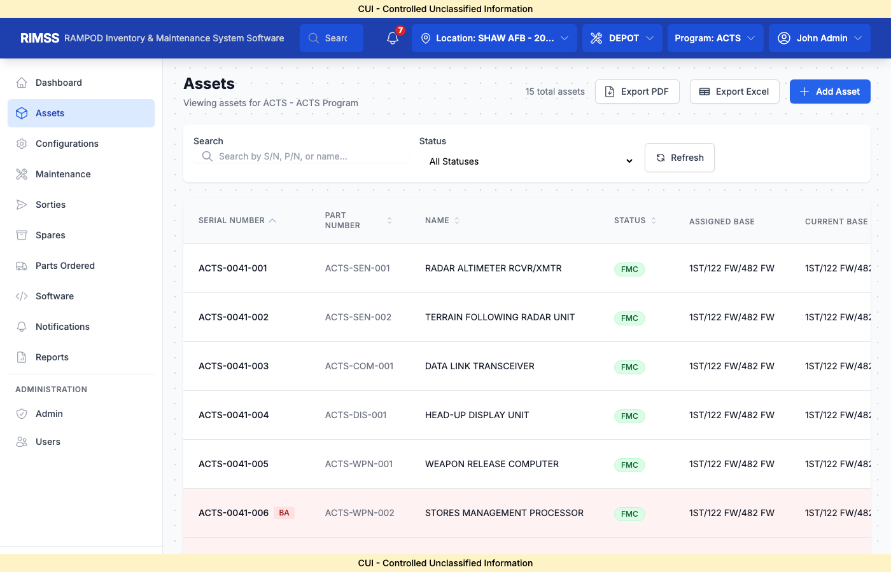

**Workflow Structure:**
```
EVENT (Job) 
  └── REPAIR(s) (Work Sequences)
        └── LABOR(s) (Individual Tasks)
              ├── PART (Removed/Installed/Worked)
              └── BIT/PC (Test Results)
```

### 4.2 Creating a Maintenance Event

Click **Create Event** or **+ New Event**.


**Required Fields:**

| Field | Description | Values |
|-------|-------------|--------|
| Asset | Serial number of asset being worked | Select from list |
| Discrepancy | Description of the problem | Free text |
| When Discovered | When issue was found | Code (D, F, A, W, S) |
| How Malfunctioned | Nature of failure | Code (290, 242, 799, etc.) |
| Event Type | Category of maintenance | CORRECTIVE, PREVENTIVE, INSPECTION |

**Job Number Generation:**
- Format: `YYYYMMDD###`
- Example: `20260206001`
- Auto-incremented per location per day

### 4.3 Event Detail


**Event Header:**
- Job Number
- Asset Serial Number
- Status (OPEN/CLOSED)
- Start/Stop dates
- Discrepancy description

**Tabs/Sections:**
- **Repairs** - Work sequences
- **Parts** - All parts worked
- **BIT/PC** - Test results
- **Attachments** - Photos, documents
- **History** - Audit trail

### 4.4 Adding Repairs

Each event can have multiple repair sequences.

**To add a repair:**
1. In event detail, click **Add Repair**
2. Enter repair information:

| Field | Description |
|-------|-------------|
| Type Maintenance | A=Service, B=Unscheduled, C=Shop, D=Scheduled |
| Start Date | When repair began |
| Stop Date | When repair completed |
| How Malfunctioned | Failure code |
| When Discovered | Discovery code |
| Narrative | Description of work performed |
| Shop Status | Current status in workflow |

3. Click **Save Repair**

### 4.5 Recording Labor

Labor records capture work details.

**To add labor:**
1. Within a repair, click **Add Labor**
2. Enter labor details:

| Field | Description | Values |
|-------|-------------|--------|
| Action Taken | What was done | F=Repair, Y=Troubleshoot, B=Bench Check, P=Removed, Q=Installed |
| Type Maintenance | Work category | A, B, C, D, E, P, R, S, T |
| Category Labor | Worker type | 1=Military, 3=Federal, 6=Contractor |
| Start Time | When work began | Date/Time |
| Stop Time | When work ended | Date/Time |
| Hours | Duration (auto-calculated) | Decimal |
| Crew Size | Number of workers | Integer |
| Corrective Action | What fixed the issue | Free text |

### 4.6 Part Removal Workflow

**CRITICAL BUSINESS LOGIC**

When a part is **REMOVED** from an asset:

1. **Select Action: REMOVED** in the labor record
2. **Select the part** being removed
3. **Enter HOW_MAL code** for the defect

**Automatic System Actions:**

```
PART REMOVED →
  ├── Create labor_part record (action=REMOVED)
  ├── Check HOW_MAL code
  │     ├── If NO-DEFECT code (799, 800, 804, 806):
  │     │     └── Status remains unchanged
  │     └── If DEFECT code:
  │           └── Change asset status → NMCM
  ├── Clear NHA_ASSET_ID (remove from parent)
  ├── Update asset location to current user's location
  ├── If NOT no-defect AND NOT CANN removal:
  │     └── Create DEPOT WORK ORDER
  └── If ECU (battery component):
        └── Create 365-day PMI record
```

**No-Defect HOW_MAL Codes:**
| Code | Description |
|------|-------------|
| 799 | No Defect Found |
| 800 | Operational Check Satisfactory |
| 804 | Removed for Convenience |
| 806 | Removed for TCTO Compliance |

### 4.7 Part Installation Workflow

When a part is **INSTALLED**:

1. **Select Action: INSTALLED** in the labor record
2. **Select or scan the replacement part**
3. **Confirm parent asset (NHA)**

**Automatic System Actions:**

```
PART INSTALLED →
  ├── Create labor_part record (action=INSTALLED)
  ├── Set NHA_ASSET_ID to parent asset
  ├── Clear in_transit flag
  ├── Set recv_date to current date
  ├── If ECU (battery component):
  │     └── Close any open 365-day PMI
  └── Check if parent POD needs new PMI
```

### 4.8 BIT/PC Tracking

Built-In Test / Part Change records.

**To add BIT/PC:**
1. In labor record, click **Add BIT/PC**
2. Enter:
   - BIT Part Number
   - BIT Name
   - Sequence (auto-incremented)
   - WUC Code
   - HOW_MAL Code
   - Quantity
3. Click **Save**

### 4.9 Closing an Event

**To close a maintenance event:**
1. Verify all repairs are complete
2. Verify all labor is recorded
3. Click **Close Event**

**Validation Rules:**
- All repairs must have stop dates
- Asset status must be valid (FMC/PMC)
- Cannot close with open NMC status unless condemned

---

## 5. PMI Module

### 5.1 PMI Overview

Preventive Maintenance Inspections are scheduled tasks.

**PMI is displayed on the Dashboard:**


**PMI Due Calendar:**
- 🔴 **Red** - Overdue (past due date)
- 🟡 **Yellow** - Due within 30 days
- 🟢 **Green** - On schedule

### 5.2 PMI Types

| PMI Type | Interval | Description |
|----------|----------|-------------|
| 30-DAY | 30 days | Monthly inspection |
| 120-1 | 120 days | Quarterly inspection |
| 180-DAY | 180 days | Semi-annual inspection |
| 360L | 365 days | Annual / Battery replacement |

### 5.3 Calendar vs Meter-Based

**Calendar-Based:**
- Scheduled by `next_due_date`
- Counts days since last completion

**Meter-Based:**
- Scheduled by `next_due_etm` (Elapsed Time Meter)
- Counts operating hours

### 5.4 Completing a PMI

1. Open the PMI record
2. Enter completion details:
   - Completion date
   - Completed ETM reading
   - Job number (link to event)
   - Completed by
3. System auto-calculates `next_due_date` and `next_due_etm`

### 5.5 ECU Battery PMI (365-Day)

Special logic for Environmental Control Units:

**On ECU Removal:**
- System creates 365-day PMI automatically
- Due date = removal date + 365 days

**On ECU Installation:**
- System closes any open 365-day PMI for that asset

---

## 6. Configurations

### 6.1 Configuration Overview

Configurations define expected assembly structures.

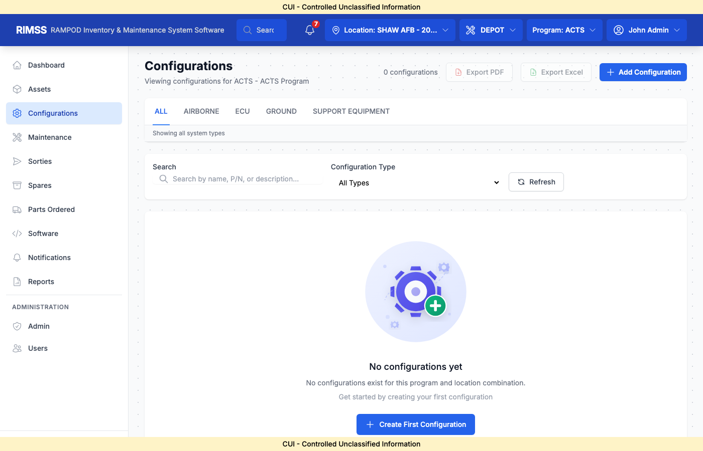

### 6.2 Hierarchy Levels

RIMSS supports up to **5 levels** of nesting:

```
Level 1: POD (Top-level assembly)
  Level 2: Major Subsystem
    Level 3: Replaceable Unit (SRU)
      Level 4: Component (LRU)
        Level 5: Sub-component
```

### 6.3 Configuration Sets

A Configuration Set is a template defining:
- Part hierarchy (parent-child relationships)
- QPA (Quantity Per Assembly) for each part
- Expected structure for comparison

### 6.4 Comparing Actual vs Configured

**To compare:**
1. Open configuration detail
2. Click **Compare to Actual**
3. System shows:
   - ✅ Parts present as expected
   - ⚠️ Parts missing from configuration
   - ❓ Extra parts not in configuration

### 6.5 Assigning Assets to Configurations

1. Open the asset detail
2. Click **Assign Configuration**
3. Select from available configuration sets
4. System validates compatibility

---

## 7. Sorties

### 7.1 Sortie Overview

Sorties track flight missions and correlate with maintenance.

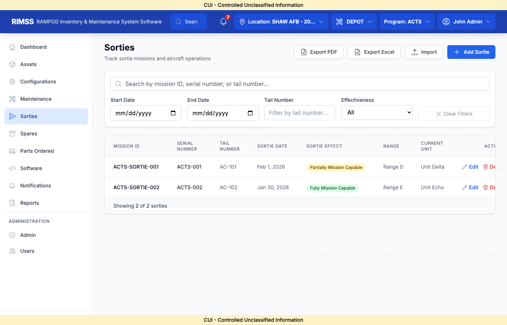

### 7.2 Creating a Sortie

Click **+ Add Sortie** to open the creation form.

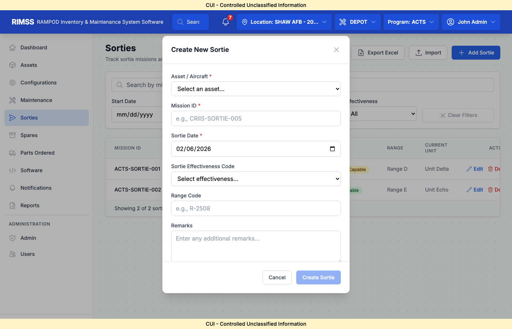

**Required Fields:**

| Field | Description |
|-------|-------------|
| Asset / Aircraft | Select asset flown |
| Mission ID | Unique mission identifier (e.g., ACTS-SORTIE-005) |
| Sortie Date | Date of flight |
| Sortie Effectiveness Code | Mission outcome |
| Range Code | Training range used |
| Remarks | Additional notes |

### 7.3 Sortie Effectiveness Codes

| Code | Meaning |
|------|---------|
| EFFECTIVE | Mission completed successfully |
| NON-EFFECTIVE | Mission aborted or failed |
| PARTIAL | Partial mission completion |
| OTHER | Other outcome |

### 7.4 Sortie Detail

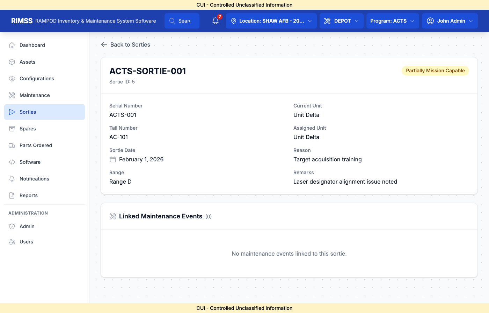

**Detail Information:**
- Mission data
- Asset information
- Linked maintenance events
- Validation status

### 7.5 Importing Sorties

**To bulk import:**
1. Click **Import** button
2. Upload CSV or Excel file
3. Map columns to fields
4. Review and confirm
5. System creates sortie records

---

## 8. Spares

### 8.1 Spares Overview

The Spares module manages untracked spare parts inventory.

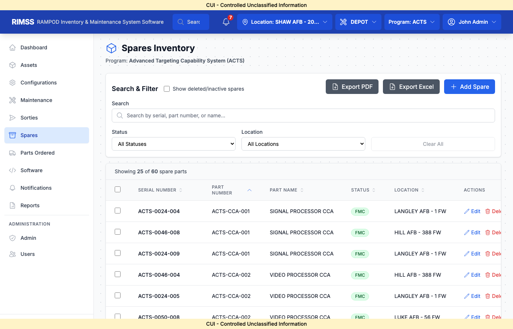

### 8.2 Creating a Spare

Click **+ Add Spare** to open the creation form.

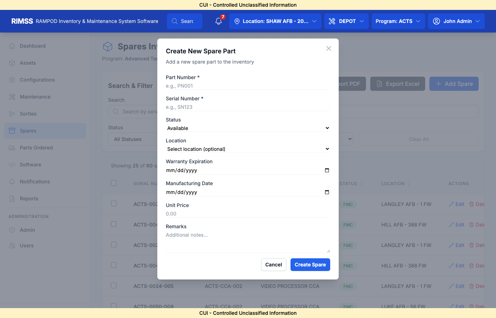

**Fields:**

| Field | Description | Required |
|-------|-------------|----------|
| Part Number | Catalog part number | Yes |
| Serial Number | Unique identifier | Yes |
| Status | Initial status | Yes (default: Available) |
| Location | Storage location | No |
| Warranty Expiration | Warranty end date | No |
| Manufacturing Date | When manufactured | No |
| Unit Price | Cost per unit | No |
| Remarks | Additional notes | No |

### 8.3 Spare Status Values

| Status | Description |
|--------|-------------|
| AVAILABLE | Ready for issue |
| RESERVED | Held for a work order |
| ISSUED | Converted to tracked asset |
| REPAIR | Awaiting repair |
| NMC | Not mission capable |
| INSPECTION | Under inspection |

### 8.4 Issuing a Spare

**To issue a spare (convert to asset):**
1. Find the spare in the list
2. Click **Issue**
3. Enter destination location
4. System creates a new tracked Asset
5. Spare record marked as ISSUED

### 8.5 Reserving a Spare

**To reserve for a work order:**
1. Find the spare
2. Click **Reserve**
3. Link to parts order or event
4. Status changes to RESERVED

---

## 9. Parts Ordering

### 9.1 Parts Ordering Overview

Parts ordering follows a 5-step lifecycle.

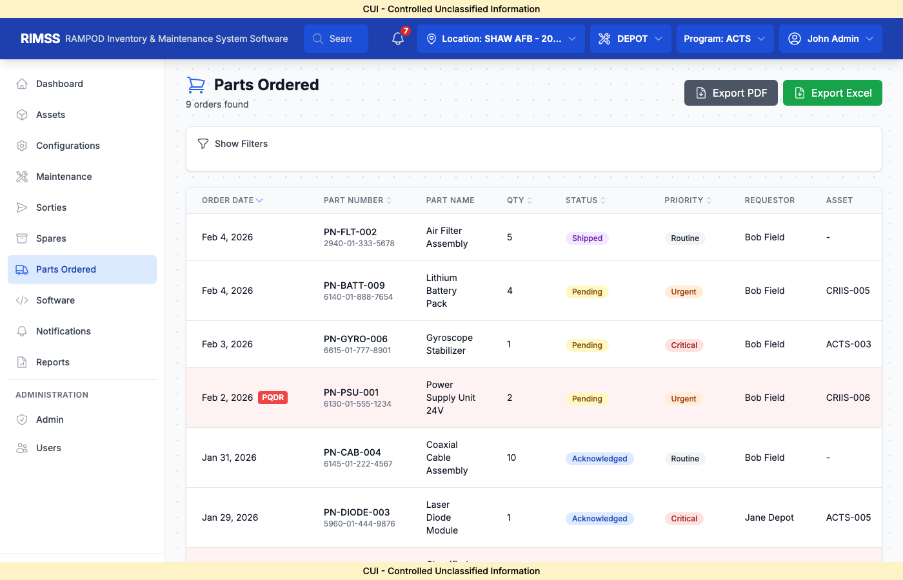

### 9.2 Order Lifecycle

```
REQUESTED → APPROVED → ORDERED → RECEIVED → ISSUED
```

| Status | SHOP Action | DEPOT Action |
|--------|-------------|--------------|
| REQUESTED | Create order | - |
| APPROVED | - | Approve request |
| ORDERED | - | Place with vendor |
| RECEIVED | - | Receive shipment |
| ISSUED | Pick up part | Issue to SHOP |

### 9.3 Creating a Parts Order

**SHOP Role:**
1. Navigate to **Parts Ordered**
2. Click **Request Part** or **+ New Order**
3. Enter order details:
   - Part Number
   - Quantity needed
   - Priority (ROUTINE, URGENT, MICAP)
   - Linked event/repair (optional)
   - Notes/justification
4. Click **Submit Request**

### 9.4 Order Priorities

| Priority | Description | Approval |
|----------|-------------|----------|
| ROUTINE | Standard processing | Requires DEPOT approval |
| URGENT | Expedited handling | Requires DEPOT approval |
| MICAP | Mission Impaired | **Auto-approved** |

### 9.5 Order Detail

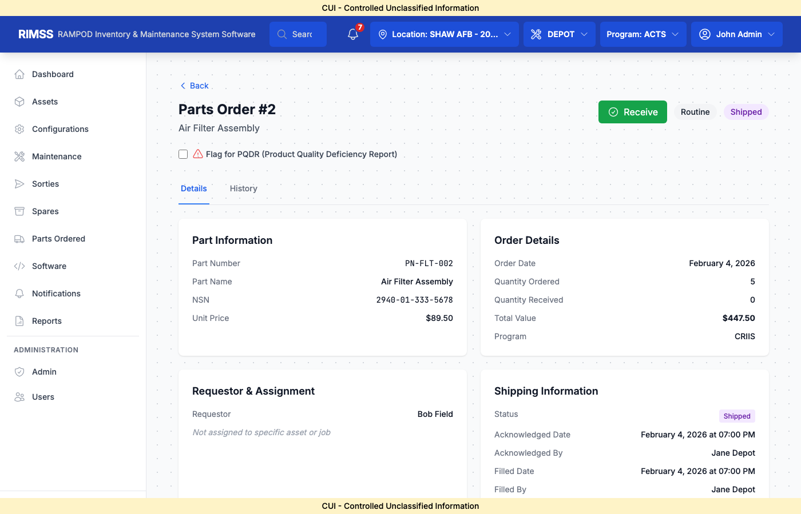

**Detail Sections:**
- Order header (order number, status)
- Part information
- Requestor/approver details
- Status history timeline
- Actions available

### 9.6 DEPOT Approval Workflow

**DEPOT_MANAGER Role:**
1. View pending orders
2. Click **Approve** or **Reject**
3. If rejecting, enter reason
4. Order moves to next status

### 9.7 Receiving and Issuing

**To receive an order:**
1. Find order with ORDERED status
2. Click **Receive**
3. Enter quantity received
4. Status changes to RECEIVED

**To issue to SHOP:**
1. Find order with RECEIVED status
2. Click **Issue**
3. Enter issued-to information
4. Status changes to ISSUED

---

## 10. Software Tracking

### 10.1 Software Overview

Track software versions loaded on assets.


### 10.2 Software Fields

| Field | Description |
|-------|-------------|
| Software Number | Identifier |
| Type | Software category |
| Revision | Version number |
| Revision Date | When released |
| Title | Software name |
| Effective Date | When applicable |

### 10.3 Linking Software to Assets

1. Open asset detail
2. Navigate to **Software** tab
3. Click **Add Software**
4. Select software version
5. Enter effective date

---

## 11. Notifications

### 11.1 Notifications Overview

System alerts for important events.

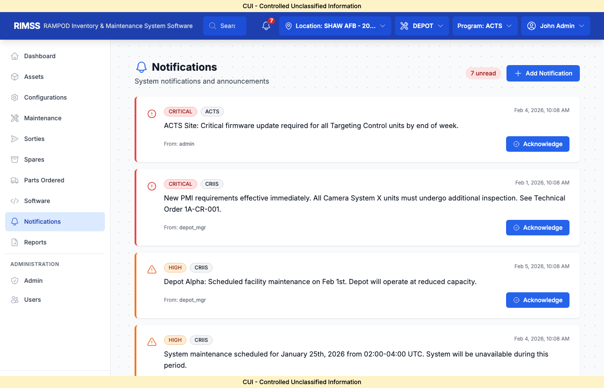

### 11.2 Notification Types

- **PMI Due** - Inspection coming due
- **Parts Order** - Order status changes
- **Asset Transfer** - Shipment updates
- **System** - Administrative messages

### 11.3 Acknowledging Notifications

1. Click notification row
2. Review details
3. Click **Acknowledge**
4. Notification marked as read

---

## 12. Reports

### 12.1 Reports Hub

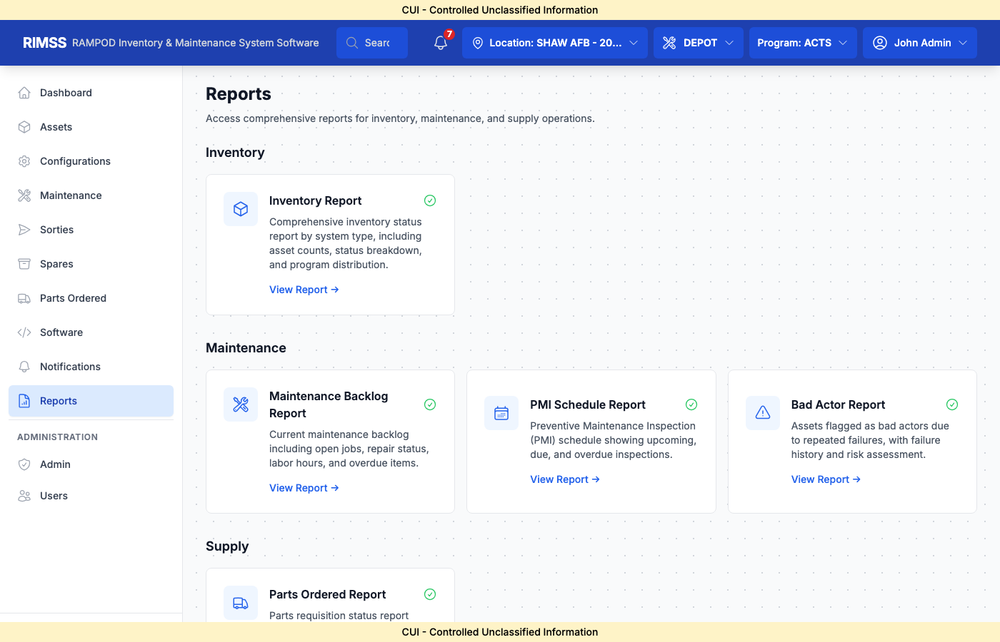

Reports are organized by category.

### 12.2 Inventory Reports

**Inventory Report:**
- Asset counts by status
- Program distribution
- Location summary

### 12.3 Maintenance Reports

**Maintenance Backlog Report:**
- Open jobs
- Repair status
- Labor hours
- Overdue items

**PMI Schedule Report:**
- Upcoming inspections
- Due/overdue counts
- Completion rates

**Bad Actor Report:**
- Assets with chronic failures
- Failure history
- Risk assessment

### 12.4 Supply Reports

**Parts Ordered Report:**
- Order status summary
- Pending approvals
- Fill rates

### 12.5 Running Reports

1. Click **View Report** on desired report card
2. Set filter parameters:
   - Date range
   - Program
   - Location
   - Status
3. Click **Generate**
4. Export to PDF or Excel

---

## 13. Administration

### 13.1 Admin Overview

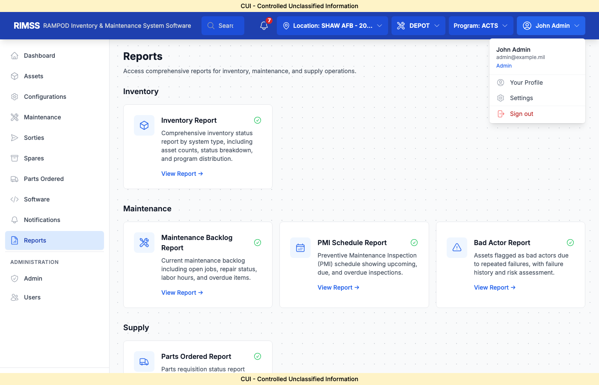

### 13.2 User Management

**To create a user:**
1. Navigate to **Users**
2. Click **Add User**
3. Enter:
   - Username
   - Email
   - First/Last name
   - Password
   - Role (ADMIN, DEPOT_MANAGER, FIELD_TECHNICIAN, VIEWER)
4. Assign programs
5. Assign locations
6. Click **Create**

### 13.3 Program Assignment

Users must be assigned to programs to access data:
1. Edit user
2. Check programs to grant access
3. Set default program
4. Save

### 13.4 Location Assignment

Users must be assigned to locations:
1. Edit user
2. Select locations from available list
3. Set default location
4. Save

### 13.5 Code Management

Maintain lookup codes for dropdowns:
- STATUS codes
- HOW_MAL codes
- ACTION_TAKEN codes
- TYPE_MAINT codes
- And more...

### 13.6 Audit Logs

View all system changes:
1. Navigate to **Audit Logs**
2. Filter by:
   - User
   - Table
   - Date range
   - Action type
3. View old/new values for each change

---

## 14. Appendices

### Appendix A: Keyboard Shortcuts

| Shortcut | Action |
|----------|--------|
| `Ctrl+S` | Save current form |
| `Ctrl+F` | Focus search field |
| `Esc` | Close modal/dialog |
| `Enter` | Submit form |

### Appendix B: Code Reference

**When Discovered (WHEN_DISC):**
| Code | Description |
|------|-------------|
| D | During equipment operations / no down time |
| F | Unscheduled maintenance |
| A | Before flight / countdown abort |
| W | In shop repair |
| S | Depot level maintenance |

**How Malfunctioned (HOW_MAL) - Common:**
| Code | Description |
|------|-------------|
| 290 | Fails diagnostic / automatic test |
| 242 | Failed to operate - specific reason unknown |
| 799 | No defect (NO-DEFECT CODE) |
| 190 | Cracked |
| 070 | Broken |

**Action Taken:**
| Code | Description |
|------|-------------|
| F | Repair |
| Y | Troubleshoot |
| B | Bench checked serviceable |
| P | Removed |
| Q | Installed |
| T | Removed for CANN |

**Type Maintenance:**
| Code | Description |
|------|-------------|
| A | Service |
| B | Unscheduled maintenance |
| C | Shop work |
| D | Scheduled inspection |
| P | Periodic inspection |
| R | Depot maintenance |
| T | TCTO |

### Appendix C: Glossary

| Term | Definition |
|------|------------|
| **Asset** | Serial-tracked equipment item |
| **BIT** | Built-In Test |
| **CANN** | Cannibalization (removing part from one asset to fix another) |
| **ETI** | Elapsed Time Indicator (operating hours) |
| **FMC** | Fully Mission Capable |
| **LRU** | Line Replaceable Unit |
| **NHA** | Next Higher Assembly (parent) |
| **NMCM** | Not Mission Capable - Maintenance |
| **NMCS** | Not Mission Capable - Supply |
| **NRTS** | Not Reparable This Station |
| **PMC** | Partially Mission Capable |
| **PMI** | Preventive Maintenance Inspection |
| **QPA** | Quantity Per Assembly |
| **SRU** | Shop Replaceable Unit |
| **TCN** | Transportation Control Number |
| **TCTO** | Time Compliance Technical Order |
| **WUC** | Work Unit Code |

### Appendix D: Contact Information

**Technical Support:**  
Email: rimss-support@alae.mil  
Phone: 1-800-XXX-XXXX

**Training Requests:**  
Email: rimss-training@alae.mil

---

*End of Software User's Manual*

**Document Control:**
| Version | Date | Author | Changes |
|---------|------|--------|---------|
| 1.0 | 2026-02-06 | Kai | Initial release |
| 2.0 | 2026-02-06 | Kai | Added all modules, screenshots, business logic |
